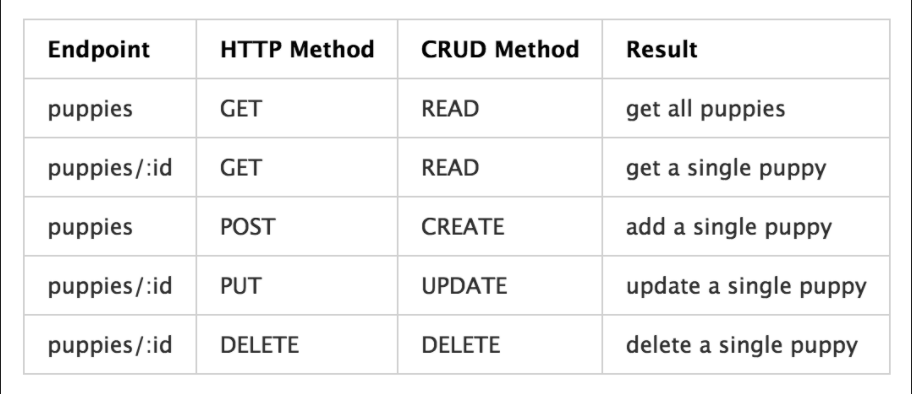

# Intro to Sinatra & MVC

## Objectives

- describe the Model View Controller (MVC) pattern
- define "convention over configuration"
- implement one model < ActiveRecord
- implement one controller
- implement ERB views
- identify the connection between REST and CRUD

## Questions

- ||= lazyloading ~> || =
  myvar ||= makemyvar()
- 
 Can't 

- setting a default path for controllers to find views

## Notes

### MVC - Model View Controller
- Model
  - define methods
  - can hold instance variables
  - interfaces w/ our database
- View
  - the external face of our software
  - in a webserver this is usually an HTML documents
- Controller
  - parse incomming requests
  - retrieve the requested data
  - and return it to the user

Why MVC?

- scalability - clear pathway for new features
- maintainability - other developers know the rules
- DRY - views can use dynamic data as templates
- community/support - common patterns help people communicate and organize

### REST - REpresentational State Transfer

CRUD - Create, Read, Update, Destroy

1. Client-server rest application separate user interface concerns from data storage concerns
2. Stateless - each request has everything it needs to be processed and return

## Icebox

## Images

### MVC Diagram

### REST Image

